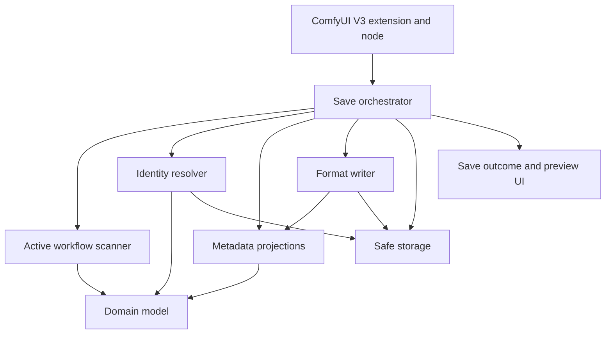
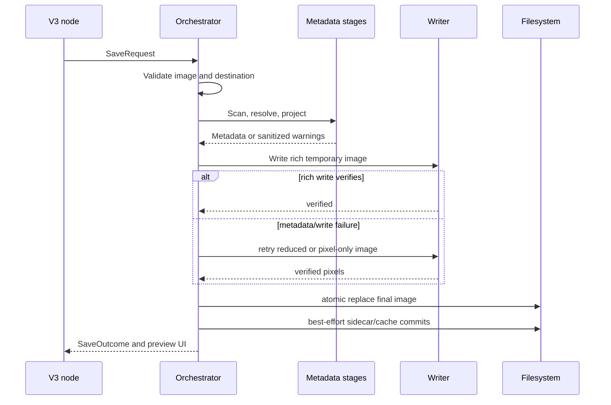

# CCollins' CiviScribe V2 Architecture

Status: Accepted for implementation
Companion authority: `docs/product_contract.md`

## 0. Decision Standard

Architecture decisions follow `docs/dev/engineering_principles.md`. The target
is not the fewest modules, lowest complexity score, newest pattern, or shortest
implementation. The target is the most correct, secure, cohesive, testable, and
maintainable design supported by evidence.

## 1. Architecture Goals

The V2 architecture optimizes for correctness, traceability, and removal of
prototype complexity. It is deliberately image-only and Civitai-first.

The architecture must provide:

- one native ComfyUI V3 entry point;
- one typed generation model;
- active-graph extraction with explicit evidence;
- deterministic metadata projections;
- thin PNG/JPEG/WebP writer adapters;
- safe, atomic output and cache storage;
- optional, bounded identity lookup;
- pixels-first failure isolation.

It must not recreate a generic media framework.

## 2. Proposed Package Layout

```text
ccollins-civiscribe/
|-- __init__.py
|-- pyproject.toml
|-- README.md
|-- civiscribe/
|   |-- __init__.py
|   |-- version.py
|   |-- extension.py
|   |-- node.py
|   |-- domain/
|   |   |-- generation.py
|   |   |-- resources.py
|   |   |-- identities.py
|   |   |-- diagnostics.py
|   |   `-- validation.py
|   |-- scanner/
|   |   |-- graph.py
|   |   |-- active_path.py
|   |   |-- stages.py
|   |   |-- prompts.py
|   |   |-- resources.py
|   |   |-- switches.py
|   |   `-- rules.py
|   |-- identity/
|   |   |-- air.py
|   |   |-- hashing.py
|   |   |-- hash_cache.py
|   |   |-- local_cache.py
|   |   |-- civitai_client.py
|   |   `-- resolver.py
|   |-- projections/
|   |   |-- a1111.py
|   |   |-- civitai.py
|   |   |-- comfyui.py
|   |   |-- exif.py
|   |   `-- sidecar.py
|   |-- schemas/
|   |   `-- sidecar-v2.schema.json
|   |-- writers/
|   |   |-- protocol.py
|   |   |-- png.py
|   |   |-- jpeg.py
|   |   |-- webp.py
|   |   `-- registry.py
|   |-- storage/
|   |   |-- paths.py
|   |   |-- templates.py
|   |   |-- atomic.py
|   |   |-- sidecar.py
|   |   `-- counters.py
|   |-- security/
|   |   |-- limits.py
|   |   |-- redaction.py
|   |   `-- transport.py
|   `-- orchestration/
|       |-- request.py
|       |-- pipeline.py
|       `-- outcome.py
|-- web/
|   |-- src/
|   |   `-- civiscribe.ts
|   |-- dist/
|   |   `-- civiscribe.js
|   `-- locales/
|-- tests/
|   |-- unit/
|   |-- integration/
|   |-- golden/
|   |-- fixtures/workflows/
|   `-- frontend/
|-- tools/
|   |-- inspect_output.py
|   |-- validate_sidecar.py
|   |-- scan_workflow_fixtures.py
|   `-- build_release.py
`-- docs/
    |-- v2/
    `-- research-archive/
```

The exact names may change during implementation, but module ownership may not
collapse back into a monolithic node module.

## 3. Dependency Direction



Rules:

- Domain modules import no ComfyUI, Pillow, filesystem, or network code.
- Scanner modules depend on normalized graph structures and domain types.
- Projections are pure functions over the domain model.
- Writers consume bytes/strings produced by projections and do not rescan the
  workflow.
- Storage owns path validation, atomic replacement, and counters.
- The Civitai client owns HTTP. No other module performs network requests.
- The V3 node translates ComfyUI values into a request and translates the
  outcome into `io.NodeOutput`; it contains no business logic.

## 4. Native V3 Boundary

The package root exports:

- `WEB_DIRECTORY`;
- `comfy_entrypoint`.

It does not export legacy node mappings.

`extension.py` defines a `ComfyExtension` returning only
`CCollins_CiviScribe_SaveImage`.

`node.py`:

- subclasses `io.ComfyNode`;
- defines its schema with `define_schema()`;
- uses native `io.Image`, widget, hidden prompt, and hidden workflow types;
- is an output node;
- executes through a classmethod;
- returns an `io.NodeOutput` containing preview UI only, with ComfyUI file-view
  records for the exact committed outputs.

The schema is authored directly in V3. It is never generated from a V1
`INPUT_TYPES` dictionary.

## 5. Domain Model

### GenerationRecord

```python
@dataclass(frozen=True, slots=True)
class GenerationRecord:
    prompts: PromptRecord
    settings: GenerationSettings
    workflow_kind: WorkflowKind | None
    resources: tuple[ResourceRecord, ...]
    primary_resource_id: str | None
    image: ImageRecord
    generator: GeneratorRecord
    diagnostics: Diagnostics
```

### ResourceRecord

```python
@dataclass(frozen=True, slots=True)
class ResourceRecord:
    key: str
    role: ResourceRole
    kind: ResourceKind
    filename: str | None
    selected_value: str | None
    node_id: str
    node_class: str
    active: bool
    strengths: ResourceStrengths
    hashes: HashRecord
    identity: ResourceIdentity | None
    status: ResourceStatus
```

### Evidence

Every inferred field carries or can report its source:

- explicit override;
- active graph input;
- resolved linked node;
- final image;
- local cache;
- API;
- compatibility fallback.

Classification and primary-model selection must be explainable from this
evidence. This prevents a later projection from silently changing a fact.

## 6. Active Graph Scanner

The scanner is a staged pipeline:

1. Normalize API prompt node IDs, class types, inputs, and links.
2. Build one typed graph index with labeled upstream and downstream edges.
3. Find the executing CiviScribe node.
4. Traverse upstream from its `images` input with a cycle-safe `deque`.
5. Resolve known routing and switch semantics before branches enter the active
   queue.
6. Precompute active-node and shortest-distance maps.
7. Identify image-producing decode and sampler stages.
8. Select the stage closest to the saved pixels.
9. Trace model, conditioning, latent, and VAE branches.
10. Extract settings and resources.
11. Validate ambiguity and consistency.

Node support is data-oriented:

- exact node-class rules for unusual schemas;
- family rules based on input/output names and link topology;
- conservative fallback recognition for loaders and samplers;
- no execution of custom-node code during graph inspection.

Rules carry tests and provenance. A rule may not silently convert an unknown
node into a known resource based only on a filename-like string.

Index construction and ordinary traversal are `O(V + E)`. The scanner does not
use list-backed `pop(0)` queues, recursive graph walks, repeated pairwise
reachability searches, NetworkX, or imports from custom-node implementations.
Normalization enforces bounded graph, string, and nesting limits before
traversal.

## 7. Identity Resolution

The resolver receives active `ResourceRecord` values and returns new immutable
records. It does not mutate scanner state.

Resolution stages:

1. parse and validate explicit identity overrides;
2. parse workflow AIR values;
3. read privacy-safe local identity mappings;
4. consult hash cache;
5. compute permitted missing hashes;
6. optionally call Civitai;
7. reconcile results and report conflicts.

The AIR parser follows the complete supported AIR grammar and preserves raw and
canonical forms. Civitai-facing type is distinct from internal resource role.

The HTTP client:

- has one configurable API base URL;
- enforces HTTPS;
- uses a normal package User-Agent;
- uses system trust where supported;
- sends no content beyond hashes or model-version IDs;
- returns typed result variants rather than raising transport details through
  the application.

## 8. Metadata Projections

Each projection is deterministic and side-effect-free:

- `build_a1111(record) -> str`
- `build_civitai_manifest(record) -> dict`
- `build_comfy_payload(record, prompt, workflow) -> ComfyPayload`
- `build_exif_user_comment(record) -> bytes`
- `build_sidecar_projection(record, artifact, policy) -> SidecarProjection`

Projection validation checks:

- primary model/hash agreement;
- resource presence agreement;
- AIR/ID agreement;
- dimensions and workflow classification;
- no unresolved resource represented as resolved;
- no local paths or secrets.

The serializer is the only JSON encoder used by product code. It is UTF-8,
strict, deterministic, and bounded.

## 9. Writer Protocol

```python
class ImageWriter(Protocol):
    format_name: str
    extension: str

    def write(
        self,
        image: ImageFrame,
        destination: Path,
        metadata: WriterMetadata,
        options: WriterOptions,
    ) -> WriteResult: ...
```

Writers are thin:

- `ImageFrame` retains the incoming tensor/array precision until the selected
  writer performs its final conversion.
- Pillow is the sole image encoder and handles PNG, JPEG, WebP, and EXIF
  operations.
- The adapter performs one explicit, tested conversion to the Pillow mode
  required by the selected format. Normal ComfyUI RGB/RGBA output is encoded
  at 8 bits per channel.
- V2 does not implement a custom PNG codec or add a separate high-bit-depth
  backend. Pillow's lack of multichannel 16-bit PNG writing is a documented
  capability limit.
- The PNG adapter owns required tEXt/iTXt/eXIf chunk choices.
- JPEG and WebP adapters own EXIF container details and format options.
- PNG and WebP default to lossless output; JPEG defaults to quality 100,
  optimized coding, and 4:4:4 chroma while remaining explicitly labeled lossy.
- Writers do not perform lookup, hashing, graph scanning, naming, or sidecar
  generation.
- Writer post-checks reopen the image and verify format, dimensions, and required
  metadata carriers before the transaction is committed.

Writer tests compare decoded pixels for lossless PNG/WebP, verify alpha and
transparent-pixel handling, and measure JPEG error without claiming exact
equivalence.

PNG precision tests inspect the IHDR sample depth, verify the expected 8-bit
multichannel representation, and compare decoded samples with the single
documented writer-boundary conversion. A separate test proves that shared
metadata and orchestration code does not quantize the tensor before the writer.

Preview tests verify that every UI image record resolves to the same final file
that passed post-write inspection. The frontend does not create a canvas,
base64 copy, alternate thumbnail encoding, or pre-save tensor preview.

Release conformance adds independent ExifTool, PNGCheck, libjpeg-turbo, and
libwebp validation. Exiv2 and policy-restricted ImageMagick provide periodic
cross-reader evidence. The exact profiles and security boundary are defined in
`image_conformance_tooling.md`.

There is no plugin architecture for unsupported formats.

## 10. Save Transaction



The final image is committed before nonessential sidecar and cache updates.
Optional failures are reflected in `SaveOutcome` but do not invalidate a saved
image.

## 11. Storage and Paths

`storage.paths` accepts ComfyUI's output root and an untrusted template.

It:

- normalizes separators and Unicode;
- expands only documented tokens;
- sanitizes every token value;
- rejects traversal, drive prefixes, UNC paths, alternate data streams, and
  Windows device names;
- verifies the resolved parent remains under the output root;
- creates only explicit safe subfolders;
- allocates counters without overwriting an existing file.

Atomic helpers write temporary files in the destination directory, flush and
close them, then replace the reserved final name.

## 12. Cache Design

Hash and identity caches are separate, versioned JSON stores.

Properties:

- no absolute paths or user content;
- schema validation on load;
- bounded entry count and field sizes;
- corrupt files are quarantined or ignored;
- lock plus atomic replacement for writes;
- deterministic key construction;
- stale entries invalidated by size and mtime;
- successful API identities may be cached only when the user enables it.

There is no asset ledger.

Hash and identity stores share one internal transaction primitive. It uses a
per-process reentrant lock plus a sibling lock file backed by `msvcrt` on
Windows or `fcntl` on POSIX. The lock spans read, validate, merge, serialize,
flush, `fsync`, and same-directory `os.replace`. Only recognized contention is
retried; all failures are bounded, sanitized, and nonfatal.

## 13. UI Architecture

The default node presents only:

- image input;
- filename pattern;
- format;
- write sidecar;
- embed workflow;
- Civitai lookup;
- preferred AIR.

Format controls appear when their format is selected. Lookup controls appear
when lookup is enabled. Manual multi-resource controls appear only in advanced
mode.

Frontend code is limited to behavior ComfyUI V3 does not provide natively:

- progressive visibility;
- stable resizable preview of the exact saved artifact;
- accessible advanced identity editing if a native structured widget is
  unavailable.

It may not rewrite widget order, migrate serialized values, poll for old nodes,
continuously force node dimensions, crop previews, or request a lower-quality
alternate encoding.

## 14. Dependencies

Runtime dependencies should be minimal:

- Pillow as the sole PNG, JPEG, and WebP image encoder and for EXIF handling;
- HTTPX as the sole Civitai HTTP client and injectable transport boundary;
- the Python standard library for JSON, hashing, paths, atomic file
  transactions, platform locking, and TLS policy where adequate;
- `truststore` only if current supported Python/ComfyUI does not already expose
  the OS trust store reliably.

NumPy may be used at the ComfyUI image boundary when it preserves source dtype
until the writer and avoids unnecessary copies. Network clients, schema
validators, and optional hash libraries do not become required dependencies
without measured value and conformance tests.

V2 uses `hashlib.file_digest()` for full-file SHA-256 with a small chunked
fallback. It may parse and retain a trusted BLAKE3 identity supplied by Civitai
or local identity data, but it does not require or invoke the optional
`blake3` package. It has no runtime dependency on `filelock`, `portalocker`, a
general graph library, XML parser, database, video stack, archival codec, HDR
framework, or broad media plugin system. The complete decisions and audit
evidence are in `technology_decisions.md`.

Development dependencies may include typing, lint, test, fuzz, security,
accessibility, and independent media-inspection tools.

All dependencies and borrowed algorithms require an explicit license review.
GPL projects may inform behavioral tests, but code is not copied unless the
entire distribution is intentionally made license-compatible. Prefer current,
maintained, permissively licensed libraries with a clear ownership boundary.

## 15. Testing Architecture

Tests are organized by ownership:

- domain unit tests;
- scanner rule and graph tests;
- identity/cache/client tests with mocked HTTP;
- projection golden tests;
- writer binary/chunk tests;
- orchestration fault-injection tests;
- native V3 contract tests;
- frontend browser tests;
- release/package/privacy tests.

The golden corpus includes representative current ComfyUI workflows and
sanitized external graph shapes. Each fixture declares expected active stage,
prompts, settings, resources, and primary model.

Golden media and metadata are immutable plain files governed by a versioned
manifest containing relative path, size, SHA-256, provenance/license class,
expected semantic assertions, and an explicit update reason. CI never
auto-accepts changed fixtures. Byte equality is required only where it is part
of a deterministic carrier contract.

The exhaustive historical test framework is mined for useful cases, then
replaced. V2 does not carry tests for removed product features.

Before writer implementation, promote a compact set of real regressions into
sanitized golden fixtures:

- active GGUF to LoRA to sampler with disconnected loader exclusion;
- Flux.2/GGUF with model, VAE, and text encoder identity;
- switch-selected checkpoint branches;
- rgthree enabled and disabled LoRAs;
- multi-encoder and detailer prompt selection;
- txt2img versus img2img classification;
- VAE secondary-hash conflicts;
- Unicode, malformed graph, duplicate resource, and traversal cases.

Add one deterministic end-to-end test that begins with a workflow graph and
ends with an inspected saved image and validated sidecar. Maintain a compact
mock Civitai response corpus covering mirrors, conflicts, missing AIR, GGUF,
VAE, LoRA, rate limits, malformed payloads, and transport failures.

Release packaging tests must prove that large research corpora, generated
reports, local caches, and archived tools are absent from the user package.

The accepted development stack and periodic deep-validation tools are defined
in `technology_decisions.md` and `development_quality_tooling.md`.
Development tools do not become transitive runtime requirements.

The performance profile is layered:

- `pytest-benchmark` for selected microbenchmarks and trend artifacts;
- `py-spy` for on-demand CPU profiles;
- `tracemalloc` for deterministic Python allocation tests;
- optional Linux-only Memray for periodic native-allocation investigations.

Fault tests use injected `Clock`, file-operation, sleep/retry, and HTTPX
transport boundaries. Real temporary files prove operating-system semantics,
and subprocess termination proves crash recovery. Fake filesystems and global
time patching are not ordinary dependencies.

Library diagnostics use standard `logging`, a package `NullHandler`, stable
event codes, and one mandatory recursive privacy sanitizer. Raw prompts,
workflows, image data, tokens, absolute paths, complete API bodies, and unsafe
tracebacks never reach logs.

English is the canonical locale catalog. A strict validator checks duplicate
keys, recursive key/type/placeholder parity, blanks, aliases, control
characters, and expansion risk. Test-only expanded and right-to-left
pseudo-locales feed TypeScript tests plus Playwright/Axe checks for layout,
keyboard access, names, tooltips, directionality, serialization, and preview
resize stability.

GitHub Actions is the hosted CI and release provider. Nox owns the commands and
uv owns the locked environment, so workflow YAML remains a thin orchestration
layer. Pull requests receive no publication secrets or privileged self-hosted
runners. A release builds artifacts once, tests and audits those exact
artifacts across the supported matrix, attests them, requires protected
environment approval, and publishes them unchanged.

## 16. Implementation Order

1. Freeze a small set of known-good prototype outputs and scanner fixtures.
2. Scaffold the new V3-only package and domain types.
3. Implement safe paths, atomic image writes, and pixels-only PNG.
4. Implement active graph normalization and scanner core.
5. Implement A1111 and Civitai projections from `GenerationRecord`.
6. Implement exact PNG compatibility carriers.
7. Add hashing, caches, AIR, manual identities, and optional lookup.
8. Add JPEG and WebP adapters.
9. Add sidecar schema and deterministic diagnostics.
10. Add native progressive UI, preview behavior, and localization.
11. Run independent media, security, accessibility, package, and live-ComfyUI
    validation.
12. Archive the prototype and removed research outside the installed package.

No phase imports a prototype module as a permanent compatibility layer.

## 17. Prototype Modules to Mine, Not Port Whole

Useful domain knowledge currently exists in:

- `save_node/comfy/workflow_*`
- `save_node/comfy/node_scanner.py`
- `save_node/metadata/a1111.py`
- `save_node/metadata/civitai_projection.py`
- `save_node/civitai/air.py`
- `save_node/civitai/identity_resolution.py`
- `save_node/hashing/`
- `save_node/io/png_writer.py`
- `save_node/io/jpeg_writer.py`
- `save_node/io/webp_writer.py`
- `save_node/io/paths.py`
- scanner fixtures and metadata golden tests.

These are behavioral references. V2 ports small verified algorithms and tests
into the new ownership model rather than preserving the current dependency
graph.
